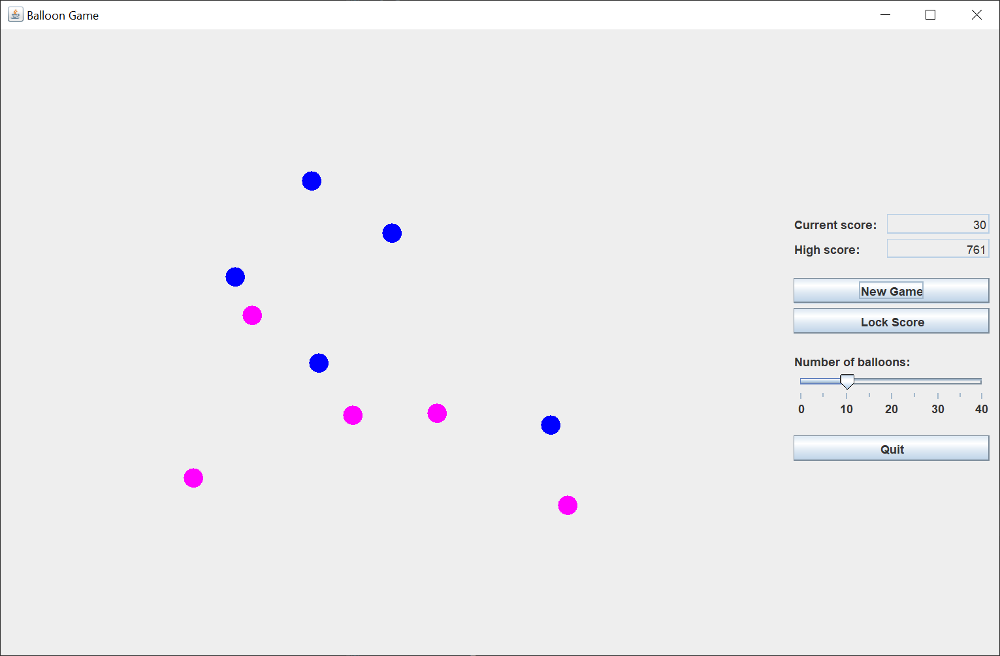
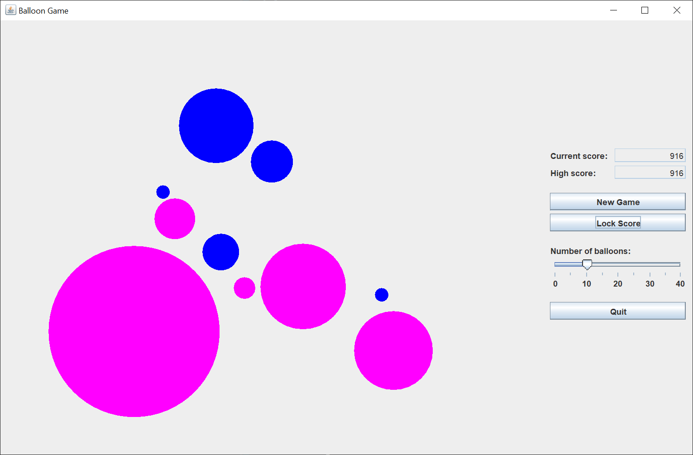

# Balloon Game

## Introduction

A student on [Stack Overflow](https://stackoverflow.com/questions/74889224/how-would-i-be-able-to-create-this-balloon-game) was given an assignment to complete a balloon game.  The game looked interesting, so I decided to code the game using Java Swing.

Here's what the GUI looks like when you start a game by left-clicking on the "New Game" button.

Balloon game is a simple game in which the player blows balloons up.  The computer places N random circles (balloons) on the board, where N is the number of balloons specified on the slider.  You can place any number between zero and forty balloons on the game board.  Zero leads to a boring game, while forty leads to lots of little circles.  Ten is a good default to start with.

You left click on a circle to increase its radius by a random amount.  If two circles touch, they turn gray and the game is over.

The object of the game is to maximize your score by making the circles as large as you can, without two or more circles touching.

Here's the GUI after I finished a round.

Left clicking on the "Lock Score" button ends the game.  You would do this when you feel like there's no more room for the circles to grow.

The score is calculated by computing the area of the colored circles and subtracting the area of any gray circles, and then dividing by 100 to keep the score in a reasonable range.  Gray circles reducing the score is why you would normally end the game by locking the score.

The game keeps track of the highest score.  This value isn't saved anywhere, so each time you play a round of games, the high score starts at zero.

## Explanation

Oracle has a helpful tutorial, [Creating a GUI With Swing](https://docs.oracle.com/javase/tutorial/uiswing/index.html).  Skip the Learning Swing with the NetBeans IDE section.  

When I create a Swing GUI, I use the [model-view-controller](https://en.wikipedia.org/wiki/Model%E2%80%93view%E2%80%93controller) (MVC) pattern.  This pattern allows me to separate my concerns and focus on one part of the application at a time.

A Java Swing model is made up of one or more plain Java getter/setter classes.

A Java Swing view is made up of one and only one `JFrame`, with as many `JPanels` or `JScrolloPanes` as necessary to create the view.

Java Swing controllers (there can be many controllers) update the model and revalidate/repaint the view.  Each controller is responsibile for it's part of the model and view.

### Model

I created two model classes for this game.

The `Balloon` class keeps track of the center point, color, and radius of one balloon.  There's a method to expand the balloon, see if this balloon is in contact with another balloon, and to calculate the score of a balloon.

The `BalloonGameModel` class keeps a `java.util.List` of valid balloons, a `List` of popped (touching) balloons, the dimensions of the drawing `JPanel`, the score, and the high score.  Methods to create the balloons, check to see if ballons are touching, and calculate the score are present.

### View

The `BalloonGameFrame` class creates the `JFrame` and a control `JPanel`.  The `JFrame` uses the default `BorderLayout` to place a drawing `JPanel` and the control `JPanel`.

The control `JPanel` uses a `GridBagLayout` to place the `JLabels`, `JTextFields`, and `JButtons`.

The drawing `JPanel` creates a drawing surface for the balloons.

### Controller

The `BalloonListener` class extends a `MouseAdapter` (`MouseListener`) to listen for left-clicks on the drawing panel (circles), expands the radius of the seclected circle, calculates the score, and repaints the circles.

The `JButton` `ActionListeners` were so simple, that I made them lambda expressions.  This Java Swing GUI required three `ActionListener` classes.

